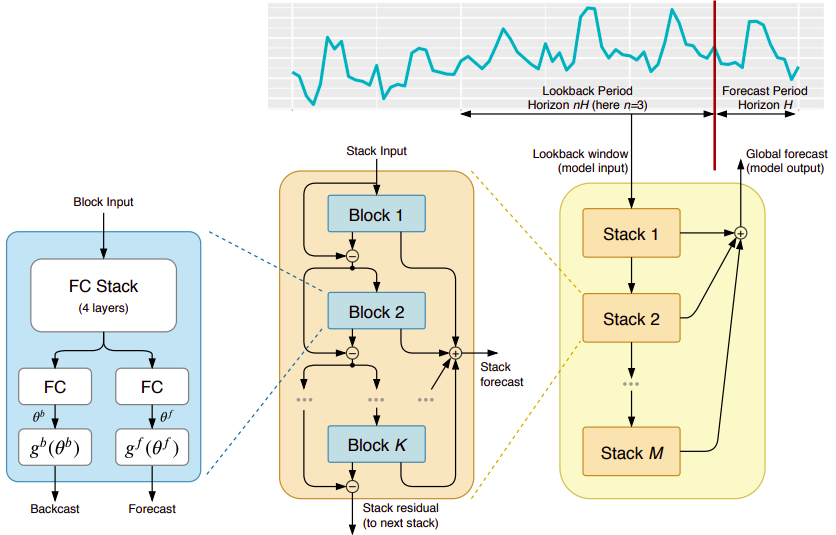
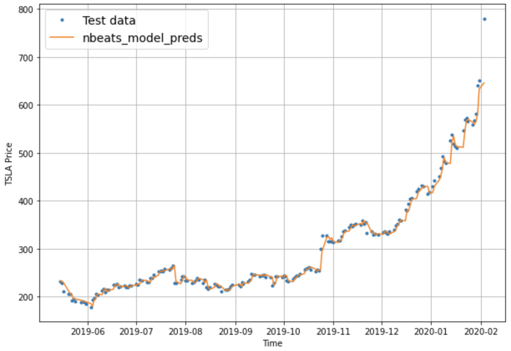

# Google Cloud Platform: N-BEATS Component
Repository for creating a custom container image for the N-BEATS deep learning model architecture. Once registered to [Google Cloud Artifact Registry][], this model can be shared and used by anyone with access to the registry to develop their own custom machine learning (ML) pipelines for time series forecasting problems.

**Disclaimer:** The model is purely for demonstrative purposes of the N-BEATS algorithm and should not be used for financial advice or to make any investment decisions.

## The N-BEATS Model

[N-BEATS][] (neural basis expansion analysis for interpretable time series forecasting) is a deep learning model developed by Boris N. Oreshkin, Dmitri Carpov, Nicolas Chapados, and Yoshua Bengio for univariate time series point forecasting. The model is based on backward and forward residual links and a very deep stack of fully-connected layers. The architecture has a number of desirable properties, being interpretable, applicable without modification to a wide array of target domains, and fast to train.

Here is the model architecture from the original paper:



## Using the Model - An Example of Forecasting Tesla (TSLA) Stock Prices

A demonstration of the model is presented in `example.ipynb` using historical Tesla (TSLA) stock prices. The model is able to forecast the day-head stock price using the historical 7-day stock prices.

The model is imported from it's source directory and called using the `.train_evaluate()` function. Results are stored in a TensorFlow `History` object for further analysis. Predictions can be made using the `.predict()` method.

The model call expects three inputs: `hparams` a dictionary object with the model hyperparameters are specified in the original paper, `train_dataset` the processed training dataset stored in a `Dataset` object, and `test_dataset` the processed testing dataset stored in a `Dataset` object.

The input data must be processed and stored in a TensorFlow `Dataset` object. Processing steps are provided in the `example.ipynb` file. These steps should be packaged into their own container and registered to Google Cloud Artifact Registry. The containers can then be used in a ML pipeline orchestrated using [Kubeflow][] and deployed to [Vertex AI][].

The model was able to forecast the day-head stock price with a mean absolute error (MAE) of **$7.69** over the testing period.

Plot of the model output:



## Use Cloud Build to build and submit your model container to Google Cloud Artifact Registry

You will use [Cloud Build][] to build and upload your custom TensorFlow model container to Google Cloud Artifact Registry.

Cloud Build brings reusability and automation to your ML experimentation by enabling you to reliably build, test, and deploy your ML model code as part of a CI/CD workflow. Artifact Registry provides a centralized repository for you to store, manage, and secure your ML container images. This will allow you to securely share your ML work with others and reproduce experiment results.

### 0. Set Global Parameters and Configure Google Cloud Project, storage bucket, and Vertex AI

Create a unique Google Cloud project ID, set the region, and specify the model directory.
```
PROJECT_ID = <enter_project_id>
REGION = <enter_region>
MODEL_DIR = 'nbeats_forecaster'
```

Create a globally unique Google Cloud Storage bucket for artifact storage.
```
GCS_BUCKET = <enter_gcs_bucket>

!gsutil mb -l $REGION $GCS_BUCKET
```

Initialize the Vertex AI Python SDK with your GCP Project, Region, and Google Cloud Storage Bucket.

```
# Import the Vertex AI Python SDK.
from google.cloud import aiplatform as vertexai

vertexai.init(project=PROJECT_ID, location=REGION, staging_bucket=GCS_BUCKET)
```

### 1. Create Artifact Registry for custom container images

```
ARTIFACT_REGISTRY='nbeats_forecaster'

!gcloud artifacts repositories create {ARTIFACT_REGISTRY} \
--repository-format=docker \
--location={REGION} \
--description='Artifact registry for ML custom training images for N-BEATS algorithm'
```

### 2. Create `cloudbuild.yaml` instructions

**Note:** A `cloudbuild.yaml` file has been provided for demonstration purposed; however, you should create your own with the appropriate configurations.

```
IMAGE_NAME = 'nbeats_forecaster'
IMAGE_TAG = 'latest'
IMAGE_URI = f'{REGION}-docker.pkg.dev/{PROJECT_ID}/{ARTIFACT_REGISTRY}/{IMAGE_NAME}:{IMAGE_TAG}'
```

```
cloudbuild_yaml = f"""steps:
- name: 'gcr.io/cloud-builders/docker'
  args: [ 'build', '-t', '{IMAGE_URI}', '.' ]
images:
- '{IMAGE_URI}'"""

with open(f'{MODEL_DIR}/cloudbuild.yaml', 'w') as fp:
    fp.write(cloudbuild_yaml)
```

### 3. Build and submit your container image to Artifact Registry using Cloud Build

Note: your custom model container will take about 16 minutes initially to build and submit to your Artifact Registry. Artifact Registry is able to take advantage of caching so subsequent builds take about 4 minutes.

```
!gcloud builds submit {MODEL_DIR} --timeout=20m --config {MODEL_DIR}/cloudbuild.yaml
```

[N-BEATS]: https://arxiv.org/abs/1905.10437
[Cloud Build]: https://cloud.google.com/build
[Google Cloud Artifact Registry]: https://cloud.google.com/artifact-registry]
[Kubeflow]: https://www.kubeflow.org/docs/components/pipelines/sdk-v2/v2-compatibility/
[Vertex AI]: https://cloud.google.com/vertex-ai
